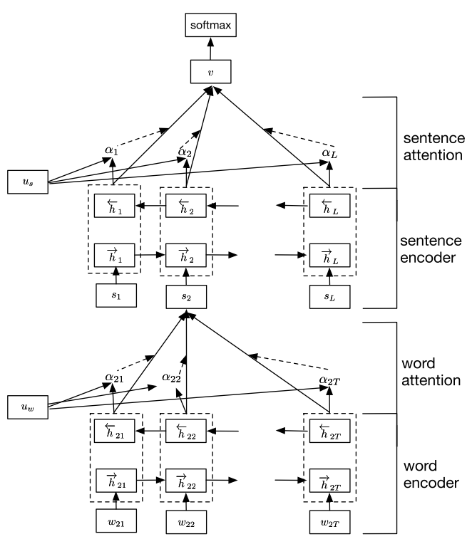
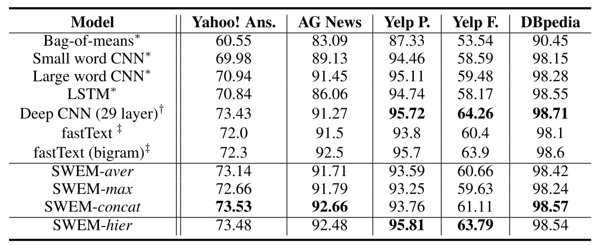

- [Hierarchical Attention Networks for Document Classification](http://www.aclweb.org/anthology/N16-1174) (HAN)
- [Baseline Needs More Love: On Simple Word-Embedding-Based Models and Associated Pooling Mechanisms](https://arxiv.org/pdf/1805.09843.pdf) (SWEM)

#Hierarchical Attention Networks for Document Classification

## 特点

- Hierarchical Structure
- 两级 attention 机制
  - word-level
  - sentence-level

## 模型

### word sequence encoder

- BiGRU

- $x_{ij}=W_e w_{ij}$

- character/word embedding

- 句子表示 $s_i$

  - 通过一个全连接层得到每个 word 的隐层表示 $u_{it}=\tanh (W_wh_{it}+b_w)$
  - 计算 attention $\alpha_{it}=\frac{\exp(u_{it}^\top u_w)}{\sum_t \exp(u_{it}^\top u_w)}$
  - 句子表示 $s_i=\sum_t \alpha_{it} h_{it}$

### sentence encoder

- BiGRU
- $h_i=\vec{\text{BiGRU}}(s_i)$
- 篇章表示 $v$
  - 通过一个全连接层得到每个句子 sentence 的隐层表示 $u_{i}=\tanh (W_sh_{i}+b_s)$
  - 计算 attention $\alpha_{i}=\frac{\exp(u_{i}^\top u_s)}{\sum_i \exp(u_{i}^\top u_s)}$
  - 篇章表示 $v=\sum_i \alpha_i h_i$

### 篇章分类

$$p=\text{softmax}(W_cv+b_c)$$

## 实验

### 数据集

共有四个数据集，都是英文的，后期可以在 FUDAN 的中文文本分类数据集上调试测试

|    数据集     | 分类数目 |  平均长度   |        数据集规模        | 语言 |
| :-----------: | :------: | :---------: | :----------------------: | :--: |
|     Yelp      |    5     | 151.6~156.9 | 335018->1125457->1569264 |  EN  |
| Amazon review |    5     |    91.9     |         3650000          |  EN  |
| Yahoo Answer  |    10    |    108.4    |         1450000          |  EN  |
|  IMDB review  |    10    |    325.6    |          348415          |  EN  |
|     FUDAN     |    20    |    2981     |      8823/981/9832       |  CN  |

### 实验结果

|    数据集     |     准确率     |
| :-----------: | :------------: |
|     Yelp      | 68.2/70.5/71.0 |
| Amazon review |      63.6      |
| Yahoo Answer  |      75.8      |
|  IMDB review  |      49.4      |

# Baseline Needs More Love: On Simple Word-Embedding-Based Models and Associated Pooling Mechanisms

## 特点

- SIMPLE
- max-pooling 提高可解释性
- hierarchical pooling 保留文本的序列信息

## 模型

- 文档：$X=\{w_1,...,w_L\}$
- word：$w_i$
- word embedding：$v_i$
- 文档表示：$z$

### Recurrent Sequence Encoder

### Convolutional Sequence Encoder

### SimpleWord-Embedding Model (SWEM)

- SWEM-aver：average pooling

  $$z=\frac{1}{L}\sum_{i=1}^L v_i$$

- SWEM-max：max pooling

  - 动机：一个句子中只有少数关键词对最终分类结果起到重要作用
  - $z=\text{Max-pooling}(v_1, ..., v_L)$

- SWEM-concat：将 SWEM-aver 和 SWEM-max 得到的特征 concatenate

- SWEM-hier：Hierarchical Pooling

  - SWEM-aver 和 SWEM-max 没有考虑词序和句子的位置（空间）信息
  - 引入局部窗口：$v_{i:i+n-1}$

## 实验结果

观察其实验结果，主要发现两点问题

- 效果并没有之前的模型好
- 篇章级文本分类的句长多为 100 个词，不适合我们真正的需求

综上所述选用第一个模型为本月计划实现模型