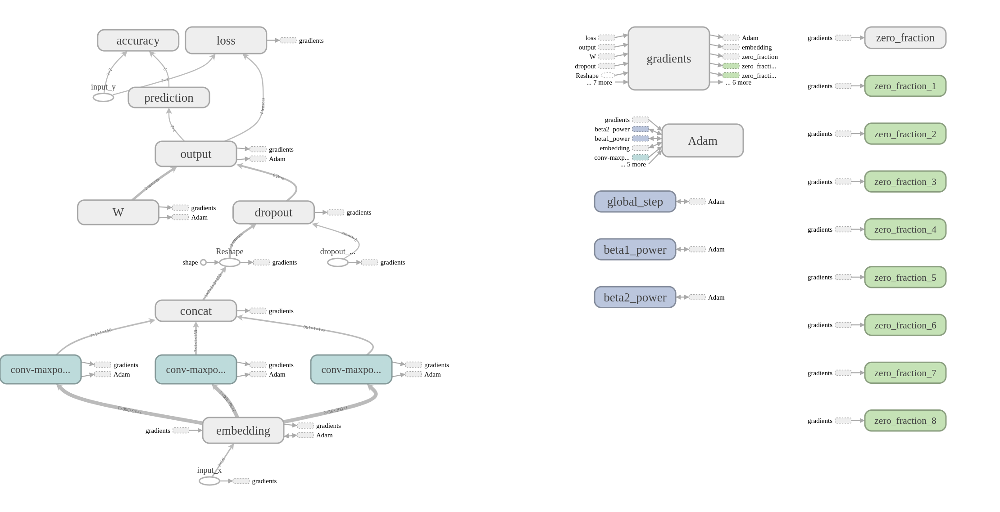
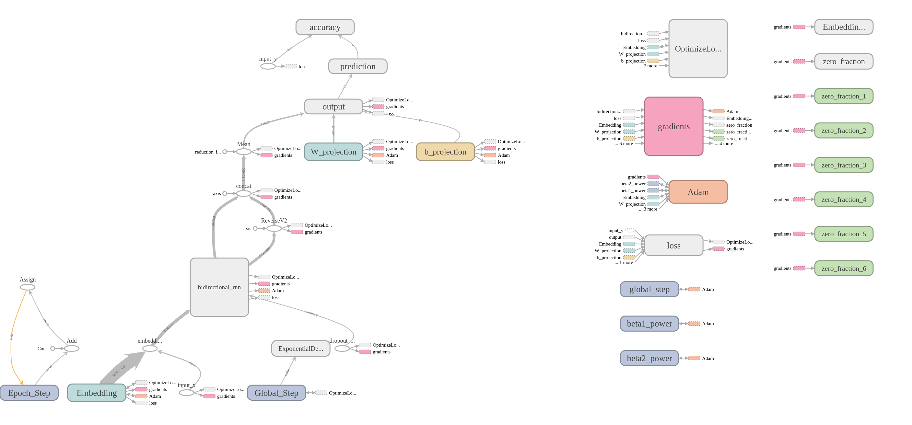
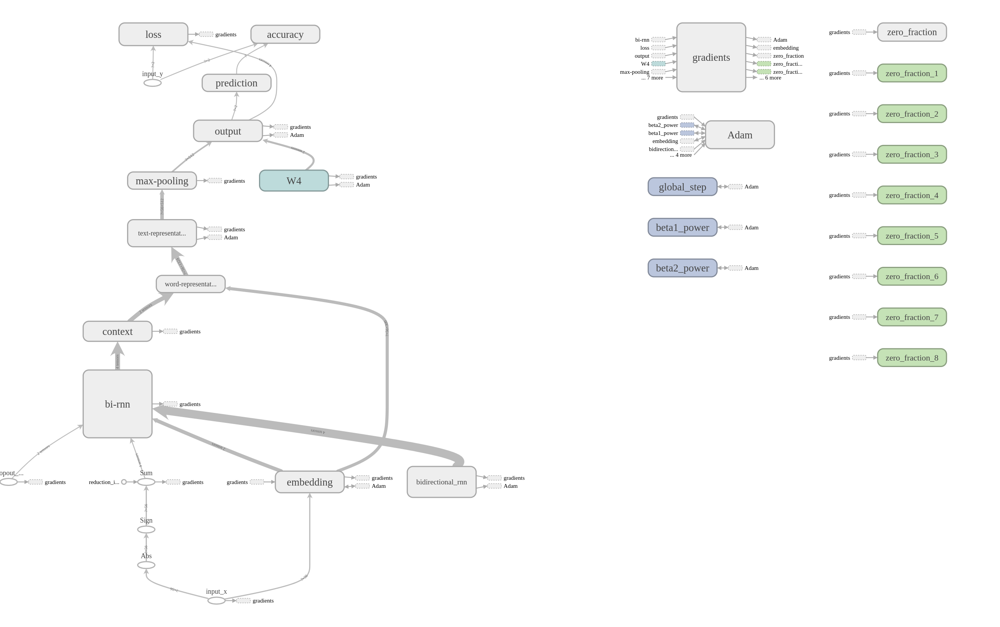
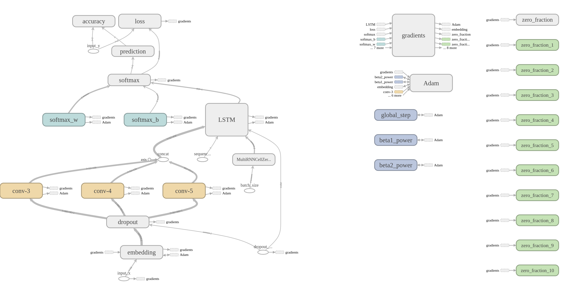

> 本项目实现了短文本分类和情感分析的四个基本模型

# Text Classification

> COMING SOON

## Requirements

- python3.5+
- tensorflow 1.+
- numpy
- gensim

## Usage

### Train

```python
python3 train.py
```

- 模型选择：

  ```python
  tf.flags.DEFINE_string("model", "clstm", "selected model of implementations, candidates: {cnn, rnn, rcnn, clstm}")
  ```

  仅需通过修改以上参数可以实现训练模型的选择

- `pretrain` 词向量载入

  采用 Google 的 300 维词向量预训练：

  ```python
  tf.flags.DEFINE_string("word2vec", "~/Downloads/GoogleNews-vectors-negative300.bin", "use word2vec")
  ```

  为了加快模型检测默认采用不加载 `pretrain` 词向量（文件很大加载到内存比较浪费时间）。

  如需采用预训练的词向量注意两点：

  - 修改 `word2vec` 的路径，保证能够找到对应文件

  - 去除注释

    ```python
    if FLAGS.word2vec:
        # initial matrix with random uniform
        initW = np.random.uniform(-0.25, 0.25,(len(vocab_processor.vocabulary_), FLAGS.embedding_size))
        # load any vectors from the word2vec
        print("Load word2vec file {}\n".format(FLAGS.word2vec))
        word_vectors = gensim.models.keyedvectors.KeyedVectors.load_word2vec_format(FLAGS.word2vec, binary = True)
        for word in word_vectors.wv.vocab:
            index = vocab_processor.vocabulary_.get(word)
            if index != 0:
                initW[index] = np.array(word_vectors[word])   
        sess.run(model.Embedding.assign(initW))
        del word_vectors
    ```

- 数据载入

  模型中默认采用 `MR` 数据集，加载方式如下：

  ```python
  text_x, y = data_preprocess.load_data_and_labels("mr")
  ```

  含义如下：

  - `text_x` ：list of str，list 中每一项为一个测试样本，已经分好词（数据集本身要分好词）
  - `y` ：list of list，list 中每一项与 `text_x` 一一对应，且格式上为 `[0, 1]` ，即以二类标签为例，所属类对应位置为 1，其余均为 0

  该数据集由于没有标准的 `train-dev-test` 划分，采用 `data_preprocess.py` 中的划分 `get_train_dev_test(x, y, dataset_name)` 方法可以帮助划分数据集

  > 对于已经划分好的数据集，COMMING SOON

- 超参设置

  见 `train.py` 中注释

### Test

```python
python3 eval.py
```

- 模型加载

  主要含有三个需要修改的参数

  - 测试模型类型

    该参数与 `train.py` 中相同

    ````python
    tf.flags.DEFINE_string("model", "clstm", "selected model of implementations, candidates: {cnn, rnn, rcnn, clstm}")
    ````

  - 模型文件路径

    ```python
    tf.flags.DEFINE_string("checkpoint_dir", "runs/1527418020/checkpoints/", "Checkpoint directory from training run")
    ```

  - 模型文件名

    ```python
    saver = tf.train.import_meta_graph(FLAGS.checkpoint_dir+"model-600.meta")
    saver.restore(sess, FLAGS.checkpoint_dir+"model-600")
    ```

- 数据加载

  如果数据集没有标准划分，刚才训练过程中已经将划分好的数据集存储，通过以下方式指定加载

  ```python
  tf.flags.DEFINE_string("mr_test_review_file", "../data/formated_data/mr/test_x.pkl", "review source for the test data.")
  tf.flags.DEFINE_string("mr_test_tag_file", "../data/formated_data/mr/test_y.pkl", "tag source for the test data.")
  ```

## 模型接口

### CNN

```python
TextCNN(
    sequence_length=train_x.shape[1],
    num_classes=train_y.shape[1],
    vocab_size=len(vocab_processor.vocabulary_),
    embedding_size=FLAGS.embedding_size,
    filter_sizes=list(map(int, FLAGS.filter_sizes.split(","))),
    num_filters=FLAGS.num_filters,
    l2_reg_lambda=FLAGS.l2_reg_lambda
)
```



### RNN

```python
TextRNN(
    sequence_length=max_document_length,
    num_classes=train_y.shape[1],
    vocab_size=len(vocab_processor.vocabulary_),
    embedding_size=FLAGS.embedding_size,
    learning_rate=FLAGS.learning_rate,
    batch_size=FLAGS.batch_size,
    decay_steps=FLAGS.decay_steps,
    decay_rate=FLAGS.decay_rate,
    is_training=FLAGS.is_training
)
```



### RCNN

```python
TextRCNN(
    sequence_length=train_x.shape[1],
    num_classes=train_y.shape[1], 
    vocab_size=len(vocab_processor.vocabulary_),
    embedding_size=FLAGS.embedding_size,
    context_embedding_size=FLAGS.context_embedding_size,
    cell_type=FLAGS.cell_type,
    hidden_size=FLAGS.hidden_size,
    l2_reg_lambda=FLAGS.l2_reg_lambda
)
```



### CLSTM

```python
TextCLSTM(
    max_len=max_document_length,
    num_classes=train_y.shape[1], 
    vocab_size=len(vocab_processor.vocabulary_),
    embedding_size=FLAGS.embedding_size,
    filter_sizes=list(map(int, FLAGS.filter_sizes.split(","))),
    num_filters=FLAGS.num_filters,
    num_layers=FLAGS.num_layers,
    l2_reg_lambda=FLAGS.l2_reg_lambda
)
```



### 其他模型引入

为方便模型接口统一以及代码简洁规范，如需引入新的模型请遵守以下规范：

- 模型命名规范

  模型名采用 `Text+ModelName` 的命名规范

- 词向量命名规范

  为了通过预训练词向量训练和测试，请将模型中的词向量命名为 `self.Embedding`

- 训练输入数据规范

  基本模型输入包含三个部分，`name` 一定要遵循规范：

  - `input_x`：输入数据的 `placeholder`

    ```python
    self.input_x = tf.placeholder(tf.int32, [None, self.sequence_length], name="input_x")
    ```

  - `input_y`：输入标签的 `placeholder`

    ```python
    self.input_y = tf.placeholder(tf.int32, [None, num_classes], name="input_y")
    ```

  - `dropout_keep_prob`： dropout 的概率，训练时自定义，dev 和 test 时为 1.0

    ```python
    self.dropout_keep_prob = tf.placeholder(tf.float32,name="dropout_keep_prob")
    ```

  - 如需添加新的 `placeholder` 请参考 `clstm` 的新变量引入规范

- 构建图关键命名规范

  该小结的规范要求是为了更好的通过模型测试，具体参考 `eval.py` 。除了训练输入数据规范，本节主要对以下几个变量进行命名规范：

  - `accuracy`：获得当前测试数据的准确率

    ```python
    with tf.name_scope("prediction"):
        self.predictions = tf.argmax(self.scores, 1, name = "predictions")
    ```

  - `predictions`：获得当前测试结果

    ```python
    with tf.name_scope("accuracy"):
        correct_predictions = tf.equal(self.predictions, tf.argmax(self.input_y, 1))
        self.accuracy = tf.reduce_mean(tf.cast(correct_predictions, "float"), name = "accuracy")
    ```

遵循以上规范的模型可以快速通过训练过程和测试过程，进而加速模型上线进程以及后期调试维护代价。

